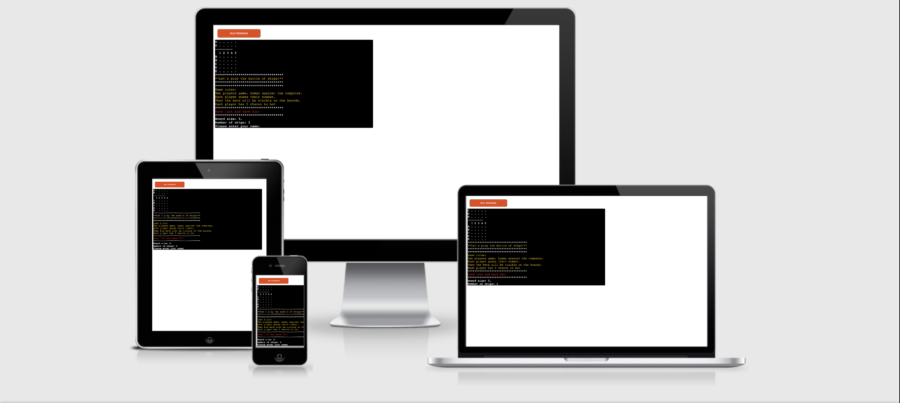
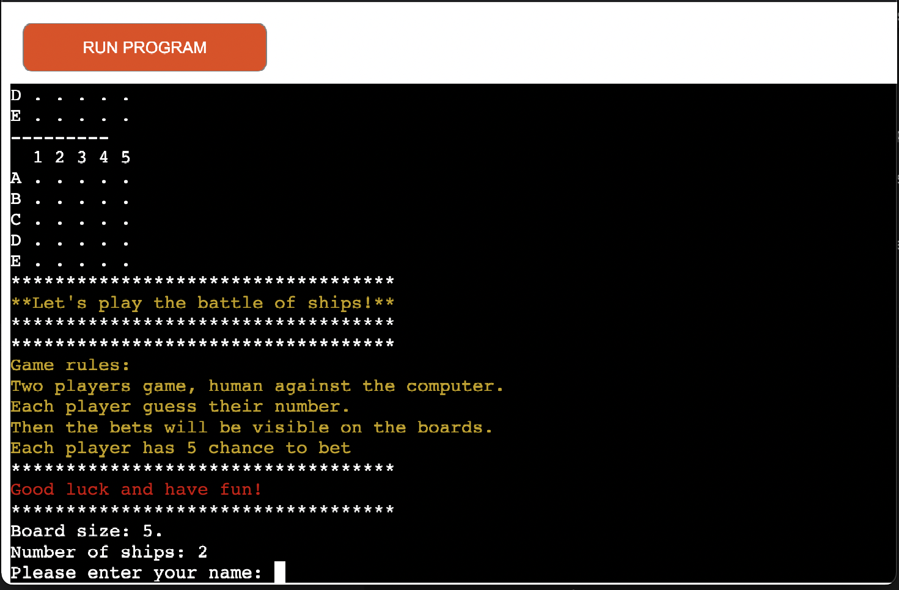
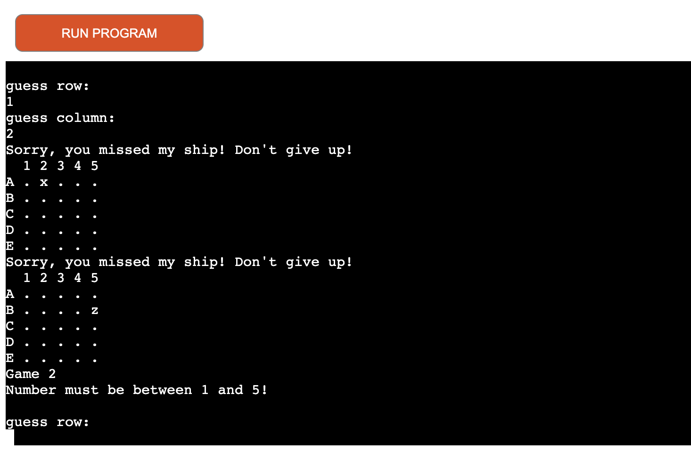

# Battle of ships

Battle of ships a Python terminal based game. Users can try to beat the computer by finding the computers ships before the computer founds the users.

[view the live project here](https://battle-of-ships-game.herokuapp.com/)

## UX

It is a game for everyone who likes battleship.

## How to play

The game is the adaptation of the classic battleship game which can be played on computer instead of on a paper with pen.
The player enter their name and than the game starts with two random boards will be generated.
The player's ship will be displayed with an "x" and the computer's ship with a "z".
The game will run for 5 turn, and the players can take a guess where the ships are.

## Features

### Existing features

- starting page

- game area

- Random Board generation

- Ships are randomly placed, player cannot see them

- Play against the computer

- accept user input

- input validation and error checking

- warning when the same number enterted twice

### Future features

- new gameplay

- scoreboard

## Technologies

- Heroku was used to deploy the program

- Git was used for version control

- Github was used to store the project

- Pep8 was used to validate

- Termcolor was used to install the colors 

## Testing

- tested the project by running in PEP8online validator

- tried with wrong or invalid data,

## Bugs

Solved bugs

- In the begining index error, because the range what i set for the validator was not correct

## Deployment

This project was deployed on Heroku, using Code Institute mock terminal.

- Create a new Heroku app

- Set the buildpacks to Python and NodeJS

- Link the heroku app to the repository

- Click on Deploy

## Credits

- Code Institue for the deployment terminal

- My mentor for the advices and feedbacks about the project

- [W3CSchool](https://www.w3schools.com/) for learning material

- [StackOverflow](https://stackoverflow.com/) the community sharing their experience and advices

